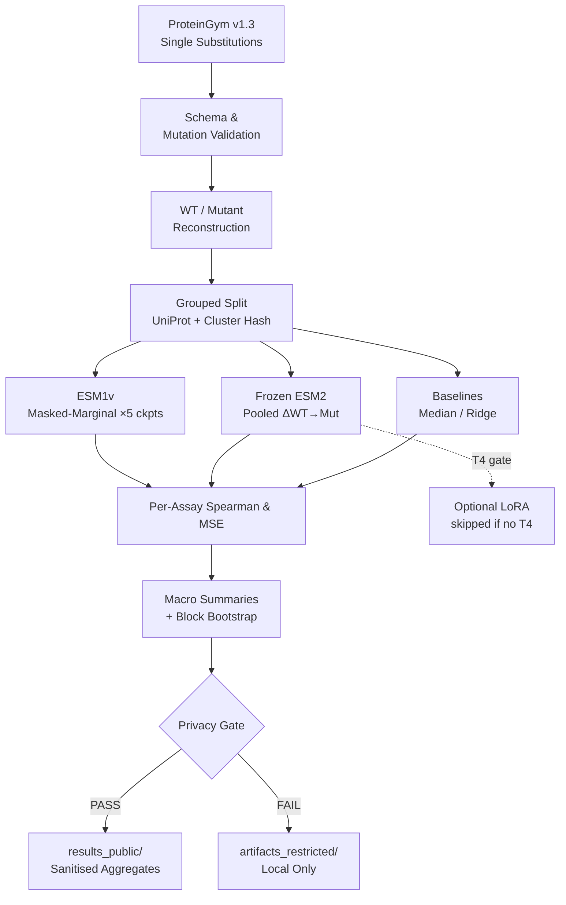

# ESM2 Protein Mutation-Fitness Benchmark

A reproducible, leakage-aware benchmark comparing frozen ESM1v and ESM2 representations against simple supervised baselines on ProteinGym single amino-acid substitution assays.

> **Research artifact.** This repository is an auditable reproducibility framework — not a clinical, experimental, commercial, or causal claim. No superior performance, biological discovery, or deployment readiness is asserted.

---

## Problem

Protein language models (ESM1v, ESM2) produce rich sequence representations, but fair comparison against simple baselines is undermined by two common failures: (1) **group leakage** — train/test splits that allow related proteins to appear on both sides, inflating apparent generalisation; (2) **silent fallbacks** — unavailable model or data stages that pass silently instead of producing an explicit `skipped` record.

This project enforces grouped splits, assay-first metrics, structured skip/failure records, and a strict public/restricted artifact boundary, making every evaluation decision auditable.

---

## Architecture



---

## Package structure

```
src/esm2_fitness/
├── schema.py          # Typed MutationRow validation
├── sequences.py       # Single-substitution parsing & WT/mutant reconstruction
├── splits.py          # Deterministic grouped split with SHA-256 manifest hash
├── metrics.py         # Per-assay Spearman, MSE, macro average
├── provenance.py      # Protocol, split, model, code, environment records
├── privacy.py         # Fail-closed public artifact path/metadata checks
├── esm1v.py           # Official five-checkpoint masked-marginal contracts
├── embeddings.py      # Frozen ESM2 pooled mutant-minus-WT shape contracts
├── contracts.py       # BenchmarkTask, EvaluatorContract, FrozenEmbeddingContract, FineTuningContract
├── checksums.py       # SHA-256 manifest helpers for evidence records
├── explainability.py  # Exploratory interpretation boundaries
├── resources.py       # T4 LoRA resource gate
├── status.py          # Structured StageStatus (skipped / ready)
└── pipeline.py        # Offline-safe CLI dispatcher

configs/
└── synthetic_protocol.yaml   # Protocol, split, model revision declarations

data_public/
└── synthetic_mutations.jsonl  # 5 independently synthetic rows (no benchmark data)

results_public/
└── README.md          # No real results present yet — see verification status below

notebooks/
├── kaggle_esm2_protein.ipynb         # Approved platform runner (Kaggle)
└── KAGGLE_RUNBOOK_esm2_protein.md    # Step-by-step execution guide

tests/                 # 87 offline contract tests
docs/                  # Protocol, compute gates, handoff records
```

---

## Installation

```bash
git clone https://github.com/ajinkya-awari/esm2-protein-fitness.git
cd esm2-protein-fitness
pip install -e .
```

Requires Python ≥ 3.11. No heavyweight ML dependencies for the offline contract layer.

---

## Local synthetic tests (offline, no data/model required)

```bash
python -m pytest -q
```

On Windows:
```powershell
./run.ps1 check
./run.ps1 synthetic
./run.ps1 gates
```

On Linux/macOS:
```bash
./run.sh check
./run.sh synthetic
./run.sh gates
```

The `gates` command reports ESM1v, frozen ESM2, and LoRA as structured `skipped` records until their approved checkpoint/data or T4 environment is available. No network access, no checkpoint download, no GPU work.

---

## Kaggle execution

Real data and model stages run in a separate approved Kaggle session. See `notebooks/KAGGLE_RUNBOOK_esm2_protein.md` for the full step-by-step guide.

**Approval gate:** the notebook stops at cell 9 (Stage B) unless explicit approval is recorded for ProteinGym data access, model checkpoints, GPU/heavy CPU work, and the output boundary. Do not run cells 10–13 without that approval in place.

```bash
# Stage the kernel (after configuring kaggle.json)
kaggle kernels push -p <KAGGLE_STAGING_FOLDER>
kaggle kernels status ajinkya1225/15-esm2-protein
```

---

## Split and leakage-control design

All assay observations for a protein are kept together by grouping on **UniProt ID** and a **deterministic MMseqs2 sequence-similarity cluster** (`min_seq_id=0.90`, `coverage=0.80`, `seed=20260818`). The split manifest is hashed with SHA-256 and stored in every provenance record. Uncertainty is bootstrapped over the declared protein/cluster group — not over independent mutation rows.

---

## Metric definitions

| Metric | Scope | Aggregation |
|--------|-------|-------------|
| Spearman ρ | Per assay | Macro average over completed assays |
| MSE | Per assay | Macro average over completed assays |
| Bootstrap CI | Group-resampled | Block bootstrap over protein/cluster groups |

Assay-level metrics are always computed before macro summaries. An assay with fewer than 2 finite paired observations is recorded as `skipped`, never silently dropped.

---

## Provenance and checksum requirements

Every evaluation record must contain:
- `protocol` — ProteinGym release version
- `split_hash` — SHA-256 of the canonical group-to-partition manifest
- `model_revisions` — exact checkpoint or HuggingFace revision string per model
- `code_revision` — Git commit SHA
- `environment` — Python version, key package versions

Source file and evidence manifests use `checksums.create_manifest` to record SHA-256 and byte size for each file.

---

## Privacy and artifact restrictions

| Artifact type | Location | Status |
|--------------|----------|--------|
| Raw ProteinGym rows | `artifacts_restricted/` | Restricted — never published |
| Sequences | `artifacts_restricted/` | Restricted |
| Embeddings | `artifacts_restricted/` | Restricted |
| Model checkpoints | `artifacts_restricted/` | Restricted |
| Hidden predictions | `artifacts_restricted/` | Restricted |
| Fitted artifacts | `artifacts_restricted/` | Restricted |
| Synthetic fixtures | `data_public/` | Public — independently invented |
| Sanitised aggregate summaries | `results_public/` | Public — after privacy gate |

The `privacy.check_public_path` and `privacy.check_public_metadata` functions enforce these boundaries with fail-closed checks. UMAP and other visualisations are exploratory only and make no biological or clinical claim.

---

## Verification status

| Stage | Status | Evidence date |
|-------|--------|--------------|
| `python -m compileall src tests` | ✅ **Locally verified** — exit 0 | 2026-09-07 |
| `python -m pytest -q` (87 tests) | ✅ **Locally verified** — 87 passed, 0.78s | 2026-09-07 |
| `pipeline check / synthetic / gates` | ✅ **Locally verified** — exit 0 | 2026-09-07 |
| Schema, split, metric, privacy contracts | ✅ **Locally verified** (synthetic fixtures) | 2026-09-07 |
| Kaggle notebook Stage A (env / source / 87 tests / gates) | ✅ **Verified** — kernel v3, 87 passed 0.25s, approval gate closed | 2026-09-07 |
| ProteinGym acquisition | 🔒 **Blocked** — requires explicit data approval | — |
| ESM1v parity (5 checkpoints) | 🔒 **Blocked** — requires checkpoint approval | — |
| Frozen ESM2 inference | 🔒 **Blocked** — requires model approval | — |
| Baseline metrics (real data) | 🔒 **Blocked** — requires data approval | — |
| Grouped bootstrap CI | 🔒 **Blocked** — requires real assay data | — |
| Optional LoRA (T4) | 🔒 **Blocked** — requires T4 gate + approval | — |
| Public results | 🔒 **Blocked** — no real benchmark runs verified | — |

---

## Limitations

- No real benchmark results are present. Public output is limited to independent synthetic fixtures and documentation.
- The LoRA route requires a T4 GPU and explicit resource gate; it is never silently run on CPU.
- An unavailable model, data source, or resource always produces a structured `skipped` record — never a silent substitution.
- This is a research reproducibility framework, not a production system. No clinical, diagnostic, or commercial use is implied.
- UMAP visualisations (when run on real data) are exploratory summaries, not causal or biological proofs.

---

## Reproducibility

All randomness is controlled by `seed=20260818` in the split configuration. The split manifest hash must match across runs. Every evaluation record must contain the protocol version, split hash, model revisions, code revision, and environment hash.

To reproduce the offline synthetic validation:

```bash
git clone https://github.com/ajinkya-awari/esm2-protein-fitness.git
cd esm2-protein-fitness
pip install -e . pytest
python -m pytest -q
```

---

## Citation and attribution

If you use this benchmark framework, please cite the underlying resources:

- **ProteinGym:** Notin et al., *Proteingym: Large-scale benchmarks for protein fitness prediction*, NeurIPS 2023.
- **ESM2 / ESM1v:** Lin et al., *Evolutionary-scale prediction of atomic-level protein structure with a language model*, Science 2023.
- **ESM1v masked-marginal scoring:** Meier et al., *Language models enable zero-shot prediction of the effects of mutations on protein function*, NeurIPS 2021.

---

## Roadmap

- [x] Kaggle Stage A: environment, source, 87 tests, all gates — verified kernel v3 (2026-09-07)
- [ ] Kaggle Stage B+: ProteinGym acquisition and processing (pending data approval)
- [ ] ESM1v parity run on official five checkpoints (pending checkpoint approval)
- [ ] Frozen ESM2 representation extraction (pending model approval)
- [ ] Baseline and Ridge regression metrics (pending data)
- [ ] Grouped bootstrap confidence intervals (pending data)
- [ ] Optional T4 LoRA run (pending T4 gate)
- [ ] Public results summary with privacy-checked aggregates
- [ ] HuggingFace Space demo (pending real results)

---

## License

MIT — see [LICENSE](LICENSE).
